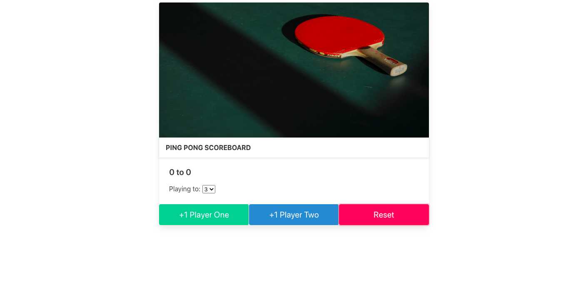

# Udemy - Wed Development Bootcamp 2022 (Colt Steele) - Pingpong Scoreboard

This is a solution to a project completed in the above course. 

## Table of contents

- [Overview](#overview)
  - [The challenge](#the-challenge)
  - [Screenshot](#screenshot)
  - [Links](#links)
- [My process](#my-process)
  - [Built with](#built-with)
  - [What I learned](#what-i-learned)
  - [Continued development](#continued-development)
  - [Useful resources](#useful-resources)
- [Author](#author)
- [Acknowledgments](#acknowledgments)

## Overview

### The challenge

Users should be able to:

- Set the winning score
- Add a point to either player
- Reset occurs if the reset button is clicked or when the winning score is changed.

### Screenshot

### Links

- Solution URL: https://github.com/samanthascarcella/Pingpong-Scoreboard
- Live Site URL:  https://samanthascarcella.github.io/Pingpong-Scoreboard/

## My process

### Built with

- Semantic HTML5 markup
- CSS custom properties
- Bulma
- Javascript

### What I learned

- How to use Bulma 
- How to use JS along side HTML and CSS

### Continued development

This project is complete (goal achieved).

### Useful resources

- Bulma (https://bulma.io)

## Author

- Website - [Samantha Scarcella] (https://github.com/samanthascarcella)
- Udemy - [Colt Steele] (https://www.udemy.com/course/the-web-developer-bootcamp/)

## Acknowledgments

I would like to acknowledge the course teacher Colt Steele for creating the above course for aspiring web developers. 

